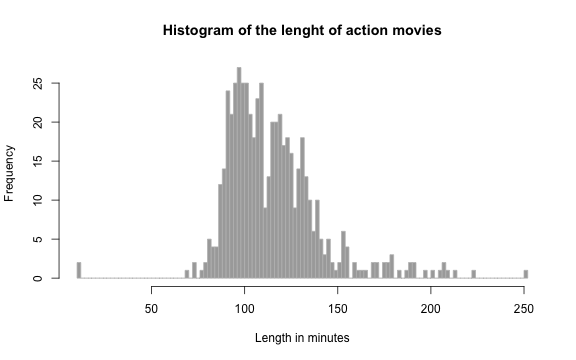
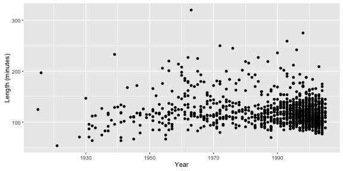

## IMDB movie ratings visualization

I was wondering wether there are any obvious patterns in the movie industry that can be easily grasped using a few graphs in R, so I tried to **visualize the IMDB movie dataset** that is included in the datasets R package, and which is also available here: *http://vincentarelbundock.github.io/Rdatasets/*

### The data

#### The dataset contains the following columns:
- **title, year, budget, length, rating, votes, mpaa rating,** and seven columns for **genre**: action, animation, comedy, drama, documentary, romance, short.

#### Omitted variables:
- title: there is no use to identify movies independently
- mpaa rating: an mpaa rating-based analysis would be interesting, but it is now out of scope
- votes: only movies having more than 1000 votes are included

---

## Data cleaning - 1


```r
data <- na.omit(data) # omitting NAs from the dataset
data <- data[which(data$votes > 1000),] # omitting entries with fewer than 1000 votes
data<- data[,c(1,2,3,4,5,6,7,19,20,21,22,23,24,25)] # selecting the appropriate columns
# columns 21-25 represent the genre and are binary variables

write.csv(data, "movies_cleaned.csv") # saving the dataset
data <- read.csv("movies_cleaned.csv") # working with the cleaned dataset
# I have created seperate dataframes for each genre
action <- data[which(data$Action == 1), ]
animation <- data[which(data$Animation == 1), ]
comedy <- data[which(data$Comedy == 1), ]
drama <- data[which(data$Drama == 1), ]
documentary <- data[which(data$Documentary == 1), ]
romance <- data[which(data$Romance == 1), ]
```

--- 

  
## Data cleaning - 2


```r
# Then after having categorized the movies, 
# I have omitted the unnecessary columns

action <- action[,c(3:9)]
animation <- animation[,c(3:9)]
comedy <- comedy[,c(3:9)]
drama <- drama[,c(3:9)]
documentary <- documentary[,c(3:9)]
romance <- romance[,c(3:9)]
```

---

## An example histogram

For instance, we can draw a histogram of the length of action movies:

```r
hist(action$length, main = "Histogram of the lenght of action movies",
                        xlab = "Length in minutes",
                        breaks = 150, col = 'darkgray', border = 'grey')
```



---

## An example plot


```r
library(ggplot2)
qplot(drama$year, drama$length, xlab = "Year", ylab = "Length (minutes)")
```



For instance, here we can observe than the excuciatingly long (longer than 3 and a half hours) drama movies only appeared later in the 20th century. 
